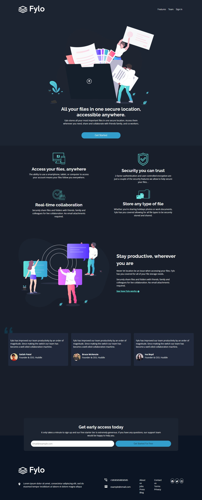

# Frontend Mentor - Fylo dark theme landing page solution

This is a solution to the [Fylo dark theme landing page challenge on Frontend Mentor](https://www.frontendmentor.io/challenges/fylo-dark-theme-landing-page-5ca5f2d21e82137ec91a50fd). Frontend Mentor challenges help you improve your coding skills by building realistic projects. 

## Table of contents

- [Overview](#overview)
  - [The challenge](#the-challenge)
  - [Screenshot](#screenshot)
  - [Links](#links)
- [My process](#my-process)
  - [Built with](#built-with)
  - [What I learned](#what-i-learned)
  - [Continued development](#continued-development)
- [Author](#author)

## Overview

### The challenge

Users should be able to:

- View the optimal layout for the site depending on their device's screen size
- See hover states for all interactive elements on the page

### Screenshot

### Links

- Solution URL: [https://github.com/obinneji/Flyo-landing-page]()
- Live Site URL: [https://obinneji.github.io/Flyo-landing-page/]

## My process

### Built with

- Semantic HTML5 markup
- CSS custom properties
- Flexbox
- [Bootstrap 5](https://getbootstrap.com/) 

### What I learned

Embarking on this project helped sharpen my skill and understanding of CSS framework(Bootstrap). I learnt major concept in bootstrap which include it grid system,flex properties(d-flex),containers and lot more. 

### Continued development

Would continue to work on the styling of this project most especially the  page background styling. will also database to store email address of eamil subscribers.

**Note: Delete this note and the content within this section and replace with your own plans for continued development.**

## Author
- Frontend Mentor - [@obinneji](https://www.frontendmentor.io/profile/obinneji)
- Twitter - [@francisobinneji](https://www.twitter.com/francisobinneji)

